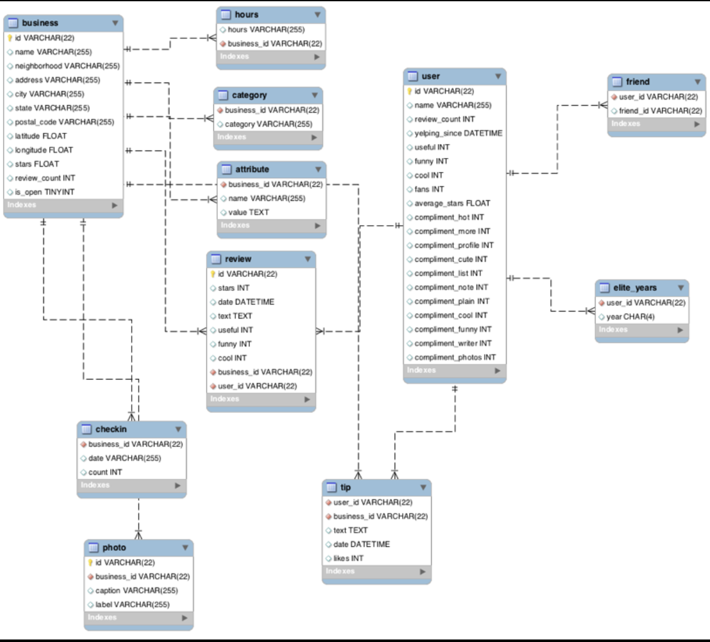
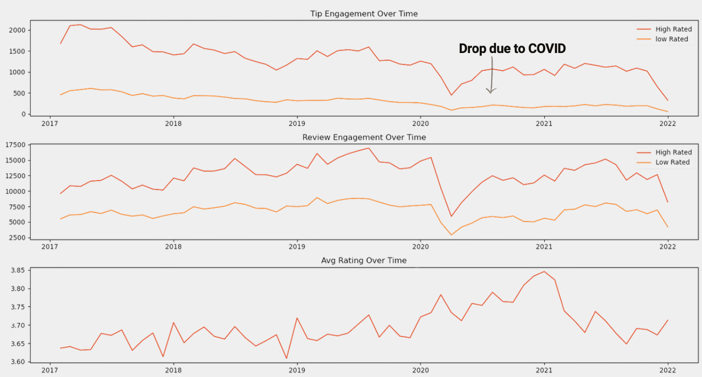
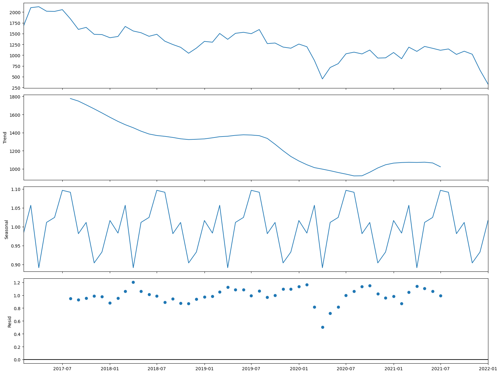
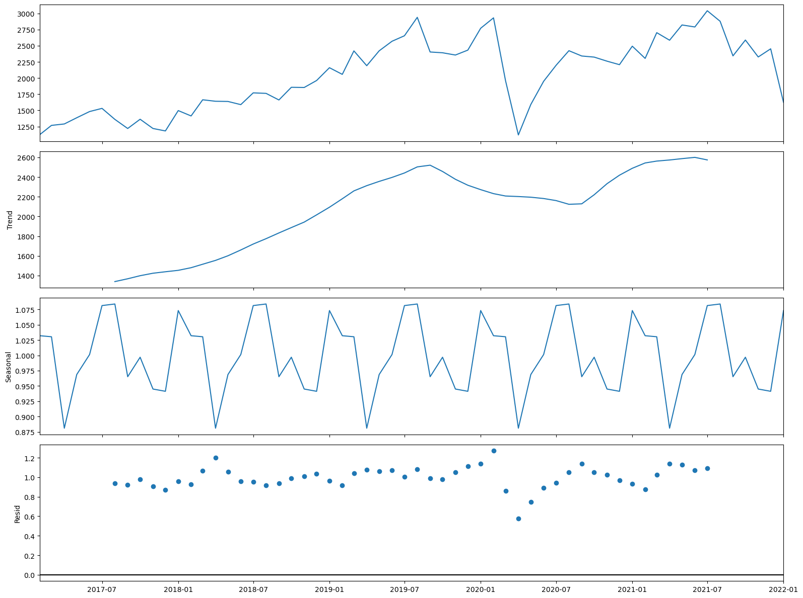
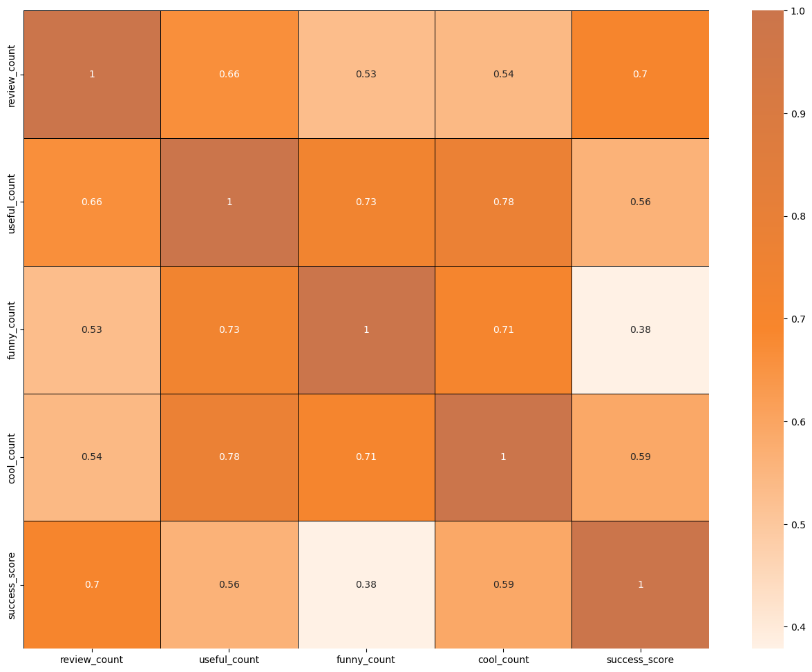
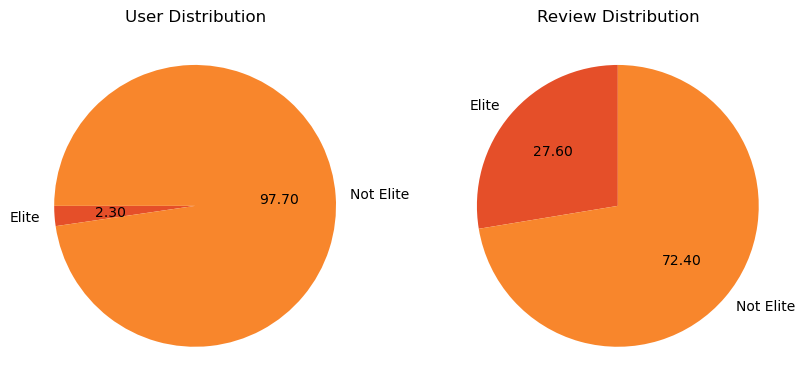
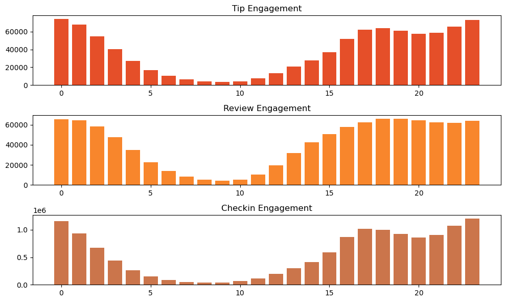

# User Engagement Analysis For Restaurant Success:
Yelp Dataset Anlaysis For Extracting  Deep Insights To Enable Restaurant Success
"""
# Yelp Dataset Analysis and Database Project

This repository contains two main components:

1. **Analysis**: Investigates factors affecting restaurant success using Yelp's dataset.
2. **Database Creation**: Processes large JSON files from Yelp's dataset and stores them in an SQLite database for efficient data retrieval.

---

## **Analysis Overview**

### **Problem Statement**
In the competitive restaurant industry, understanding factors influencing business success is vital. This analysis focuses on user engagement metrics and their correlation with review counts and ratings.

### **Research Objectives**
- Quantify the relationship between user engagement (reviews, tips, check-ins) and success metrics (review count, average star rating).
- Assess the impact of sentiment on reviews and ratings.
- Analyze time trends in user engagement to identify sustained versus sporadic activity.

### **Hypotheses**
- Higher user engagement correlates with increased review counts and ratings.
- Positive sentiment in reviews and tips leads to higher ratings and review counts.
- Consistent user engagement over time is linked to long-term restaurant success.

### **Tools & Libraries Used**
- **Data Analysis**: Pandas, NumPy
- **Visualization**: Matplotlib, Seaborn, Folium
- **Database Interaction**: SQLite, SQLAlchemy

---

## **Database Creation**

  

### **Dataset Details**
- The dataset contains information on businesses, reviews, users, tips, and check-ins across 8 metropolitan areas in the USA and Canada.
- Original data is shared by Yelp as JSON files.

### **Process**
1. **Large-Scale JSON Processing**:
   - Processed JSON files in chunks for scalability.
   - Files include:
     - `yelp_academic_dataset_business.json`
     - `yelp_academic_dataset_checkin.json`
     - `yelp_academic_dataset_review.json`
     - `yelp_academic_dataset_tip.json`
     - `yelp_academic_dataset_user.json`
2. **Database Loading**:
   - Created tables for each JSON file in SQLite.
   - Used SQLAlchemy for efficient database interaction.

### **Database Schema**
- **Tables**:
  - `business`
  - `review`
  - `user`
  - `tip`
  - `checkin`

---

## **Visualizations and Insights**

### **Graphs and Trends Analyzed**
- Correlation heatmaps to identify relationships between user engagement and success metrics.
- Time-series plots to explore trends in user engagement.
- Sentiment analysis charts to highlight the impact of positive reviews.

---
# Analysis and Findings

## Key Metrics:

  

- Out of 150,000 businesses, 35,000 are restaurant businesses that are currently open.

  
  

- **Distribution of business success metrics** (review count and average rating) highlights that:
  - Higher ratings do not guarantee a higher review count, or vice versa.
  - The success of restaurants is not solely determined by ratings or review counts.
  - Review counts reflect user engagement but not necessarily overall customer satisfaction or business performance.
---

## Do Restaurants with Higher Engagement Tend to Have Higher Ratings?

  

- Data reveals a general increase in average reviews, check-ins, and tip counts as ratings improve from 1 to 4 stars.
- Restaurants rated 4 stars exhibit the highest engagement but show a downward trend for ratings above 4.
- The drop in engagement at 5.0 stars might suggest:
  - A saturation point where fewer customers feel compelled to add reviews.
  - Selectivity, where only a small, highly satisfied audience frequents these establishments.
---

## Correlation Between Reviews, Tips, and Check-ins

  

- User engagement across different platforms (reviews, tips, and check-ins) is strongly interlinked.
- Higher activity in one metric tends to drive increases in others.
- **Recommendation**: Businesses should focus on strategies that boost all types of user engagement to enhance overall visibility and customer interaction.

---
## Is there a difference in the user engagement between high-rated and low-rated businesses?

  

- Data indicates a clear correlation between higher ratings and increased user engagement across reviews, tips, and check-ins.
- This pattern underscores the importance of maintaining high service and quality standards, as these appear to drive more reviews, check-ins, and tips.
- These metrics (reviews, check-ins, and tips) are critical for customer engagement and satisfaction.
## Engagement Differences Between High-Rated and Low-Rated Businesses
- Data shows a clear correlation between higher ratings and increased user engagement.
- Higher-rated businesses consistently drive more reviews, tips, and check-ins.
- **Insight**: Maintaining high service and quality standards drives critical engagement metrics like reviews and customer satisfaction.

---
## How do the success metrics of restaurants vary across different states and cities?

  

- Philadelphia emerges as the top city with the highest success score, indicating a combination of high ratings and active user engagement.
- Following Philadelphia, Tampa, Indianapolis, and Tucson rank among the top cities with significant success scores.
- These rankings suggest thriving restaurant scenes in these areas.

---

## Are there any patterns in user engagement over time for successful businesses compared to less successful ones?

  

- **Drop due to COVID**: Successful businesses, particularly those with higher ratings (above 3.5), exhibit consistent and possibly increasing user engagement over time.
- High-rated restaurants maintain a steady or growing level of user engagement over time.
- This trend reflects ongoing customer interest and satisfaction.

## User Engagement Trends Over Time
- **COVID Impact**: Engagement dropped during the pandemic.
- Successful businesses, particularly those rated above 3.5, show consistent or increasing user engagement over time.
- High-rated restaurants maintain steady or growing engagement, reflecting sustained customer interest and satisfaction.

### Trend and Seasonality Analysis

   
   

- Engagement follows seasonal patterns, with peaks between **November and March**.
- Evening hours from **4 PM to 1 AM** are the busiest for restaurants, driven by:
  - Work schedules
  - Social gatherings
  - Leisure activities
- **Downward Trend**: The year starting and ending (Nov - Mar) shows a highly engaging period.
- **Upward Trend**: Trends indicate that restaurants experience an increase in engagement during these months.

---
## How does the sentiment of reviews and tips (useful, funny, cool) correlate with the success metrics of restaurants?

  

- “Useful”, “Funny”, and “Cool” are attributes associated with user reviews. They represent the feedback provided by users about the usefulness, humor, or coolness of a particular review.
- Higher counts of useful, funny, and cool reviews suggest greater user engagement and satisfaction.
- These factors (useful, funny, and cool reviews) are key contributors to a restaurant's success.

## Sentiment Analysis

- Reviews categorized as "useful," "funny," and "cool" provide insights into customer satisfaction and engagement.
- Higher counts of these attributes strongly correlate with restaurant success.

---
## Elite vs. Non-Elite Users

  

- Yelp Elite users, though smaller in number, contribute significantly to total review counts.
- Establishing relationships with elite users can:
  - Enhance loyalty
  - Drive repeat visits
  - Amplify promotional efforts

## Is there any difference in engagement of elite users and non-elite users?

- Elite users are individuals who have been recognized and awarded the "Elite" status by Yelp for their active and high-quality contributions.
- Despite being significantly fewer in number, elite users contribute a substantial proportion of the total review count compared to non-elite users.
- Establishing a positive relationship with elite users can lead to repeat visits and loyalty, as they are more likely to continue supporting businesses they have had good experiences with.
---
## Busiest Hours

  

- Peak engagement hours for restaurants are between **4 PM and 1 AM**.
- **Recommendations**:
  - Optimize staffing levels and resources during these hours.
  - Introduce special promotions to capitalize on the increased demand.

### Busiest Hours Analysis

- The busiest hours for restaurants, based on user engagement, span from **4 PM to 1 AM**.
- Knowing the peak hours allows businesses to optimize their staffing levels and resource allocation during these times to ensure efficient operations and quality service delivery.
- The concentration of user engagement during the evening and night hours suggests a higher demand for dining out during these times, potentially driven by factors such as work schedules, social gatherings, and leisure activities.

---

## Recommendations

### 1. Boost User Engagement
- Encourage customer participation through loyalty programs, discounts, and promotions to increase reviews, tips, and check-ins.

### 2. Leverage Elite Users
- Collaborate with Yelp elite users to boost promotional efforts, increase brand credibility, and attract new customers.

### 3. Optimize Operations
- Align staffing and resources to peak hours (4 PM–1 AM) to meet demand efficiently.
- Introduce special offers or happy hours during high-demand periods.

### 4. Expand Strategically
- Invest in high-performing cities like Philadelphia, Tampa, Indianapolis, and Tucson to maximize growth opportunities.

### 5. Focus on Consistent Engagement
- Improve service quality, actively respond to customer feedback, and implement strategies to sustain long-term engagement.

---

## Conclusion
This analysis provides actionable insights for leveraging Yelp data to drive restaurant success. By focusing on strategies to boost user engagement, optimize operations, and expand in high-performing regions, businesses can make data-driven decisions to enhance customer satisfaction
In summary, the success of a restaurant is multifaceted, influenced by a combination of review sentiment, engagement levels, timing, and regional context. By continuously monitoring these factors and adapting to emerging trends, restaurants can enhance customer satisfaction, improve operational efficiency, and foster long-term growth. The relationship between user engagement and business success is clear: higher engagement leads to better visibility, repeat business, and a loyal customer base, all of which are critical for sustained success in a competitive market.

---

