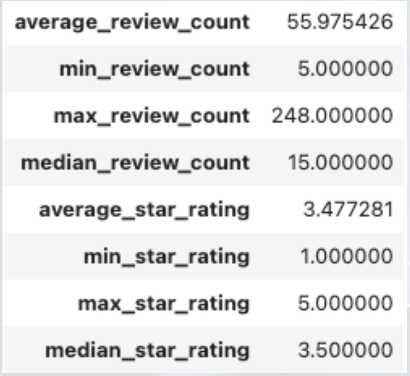
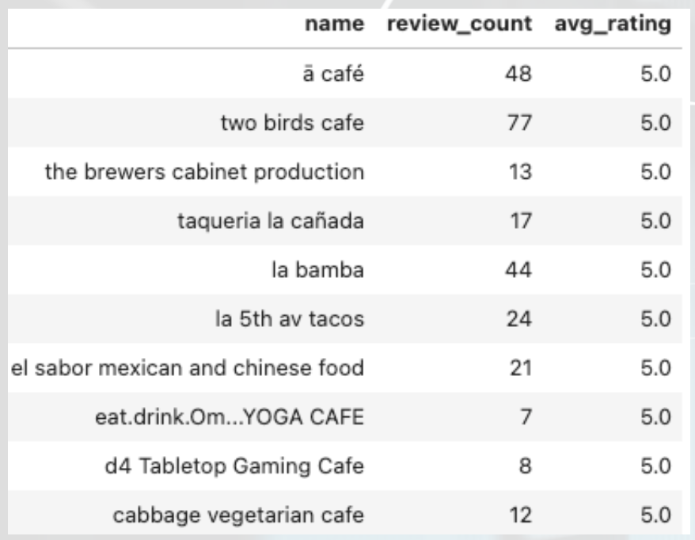
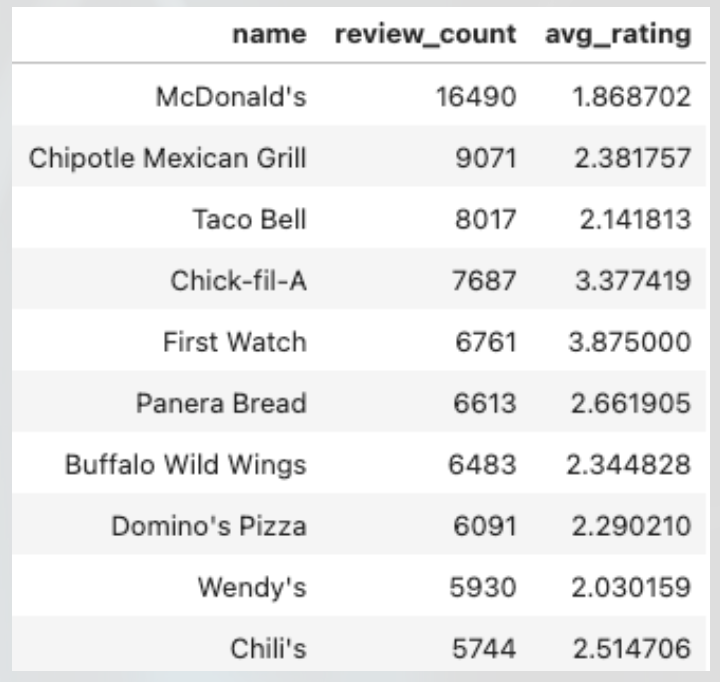
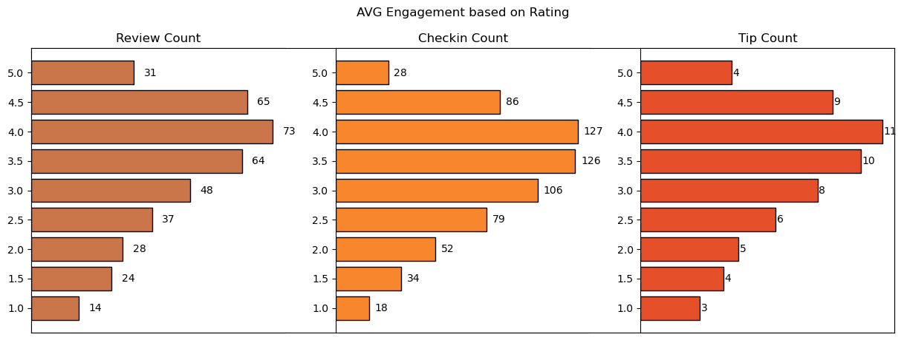
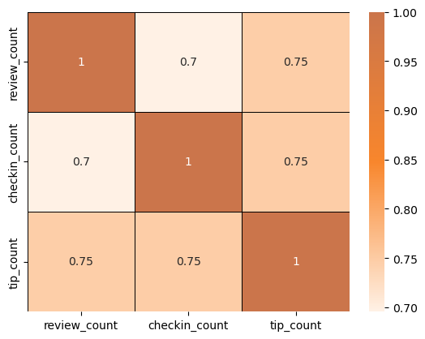
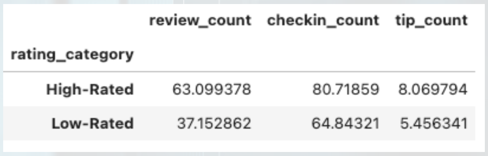

# User Engagement Analysis For Restaurant Success:
Yelp Dataset Anlaysis For Extracting  Deep Insights To Enable Restaurant Success
"""
# Yelp Dataset Analysis and Database Project

This repository contains two main components:

1. **Analysis**: Investigates factors affecting restaurant success using Yelp's dataset.
2. **Database Creation**: Processes large JSON files from Yelp's dataset and stores them in an SQLite database for efficient data retrieval.

---

## **Analysis Overview**

### **Problem Statement**
In the competitive restaurant industry, understanding factors influencing business success is vital. This analysis focuses on user engagement metrics and their correlation with review counts and ratings.

### **Research Objectives**
- Quantify the relationship between user engagement (reviews, tips, check-ins) and success metrics (review count, average star rating).
- Assess the impact of sentiment on reviews and ratings.
- Analyze time trends in user engagement to identify sustained versus sporadic activity.

### **Hypotheses**
- Higher user engagement correlates with increased review counts and ratings.
- Positive sentiment in reviews and tips leads to higher ratings and review counts.
- Consistent user engagement over time is linked to long-term restaurant success.

### **Tools & Libraries Used**
- **Data Analysis**: Pandas, NumPy
- **Visualization**: Matplotlib, Seaborn, Folium
- **Database Interaction**: SQLite, SQLAlchemy

---

## **Database Creation**

### **Dataset Details**
- The dataset contains information on businesses, reviews, users, tips, and check-ins across 8 metropolitan areas in the USA and Canada.
- Original data is shared by Yelp as JSON files.

### **Process**
1. **Large-Scale JSON Processing**:
   - Processed JSON files in chunks for scalability.
   - Files include:
     - `yelp_academic_dataset_business.json`
     - `yelp_academic_dataset_checkin.json`
     - `yelp_academic_dataset_review.json`
     - `yelp_academic_dataset_tip.json`
     - `yelp_academic_dataset_user.json`
2. **Database Loading**:
   - Created tables for each JSON file in SQLite.
   - Used SQLAlchemy for efficient database interaction.

### **Database Schema**
- **Tables**:
  - `business`
  - `review`
  - `user`
  - `tip`
  - `checkin`

---

## **Visualizations and Insights**

### **Graphs and Trends Analyzed**
- Correlation heatmaps to identify relationships between user engagement and success metrics.
- Time-series plots to explore trends in user engagement.
- Sentiment analysis charts to highlight the impact of positive reviews.

---
# Analysis and Findings

## Key Metrics:


- Out of 150,000 businesses, 35,000 are restaurant businesses that are currently open.

<div style="display: flex; justify-content: space-between;">
   
   
</div>

- **Distribution of business success metrics** (review count and average rating) highlights that:
  - Higher ratings do not guarantee a higher review count, or vice versa.
  - The success of restaurants is not solely determined by ratings or review counts.
  - Review counts reflect user engagement but not necessarily overall customer satisfaction or business performance.
---

## Do Restaurants with Higher Engagement Tend to Have Higher Ratings?


- Data reveals a general increase in average reviews, check-ins, and tip counts as ratings improve from 1 to 4 stars.
- Restaurants rated 4 stars exhibit the highest engagement but show a downward trend for ratings above 4.
- The drop in engagement at 5.0 stars might suggest:
  - A saturation point where fewer customers feel compelled to add reviews.
  - Selectivity, where only a small, highly satisfied audience frequents these establishments.
---

## Correlation Between Reviews, Tips, and Check-ins


- User engagement across different platforms (reviews, tips, and check-ins) is strongly interlinked.
- Higher activity in one metric tends to drive increases in others.
- **Recommendation**: Businesses should focus on strategies that boost all types of user engagement to enhance overall visibility and customer interaction.

---
## Is there a difference in the user engagement between high-rated and low-rated businesses?


- Data indicates a clear correlation between higher ratings and increased user engagement across reviews, tips, and check-ins.
- This pattern underscores the importance of maintaining high service and quality standards, as these appear to drive more reviews, check-ins, and tips.
- These metrics (reviews, check-ins, and tips) are critical for customer engagement and satisfaction.
## Engagement Differences Between High-Rated and Low-Rated Businesses
- Data shows a clear correlation between higher ratings and increased user engagement.
- Higher-rated businesses consistently drive more reviews, tips, and check-ins.
- **Insight**: Maintaining high service and quality standards drives critical engagement metrics like reviews and customer satisfaction.

---
## How do the success metrics of restaurants vary across different states and cities?

- Philadelphia emerges as the top city with the highest success score, indicating a combination of high ratings and active user engagement.
- Following Philadelphia, Tampa, Indianapolis, and Tucson rank among the top cities with significant success scores.
- These rankings suggest thriving restaurant scenes in these areas.

---

## User Engagement Trends Over Time
- **COVID Impact**: Engagement dropped during the pandemic.
- Successful businesses, particularly those rated above 3.5, show consistent or increasing user engagement over time.
- High-rated restaurants maintain steady or growing engagement, reflecting sustained customer interest and satisfaction.

### Trend and Seasonality Analysis
- Engagement follows seasonal patterns, with peaks between **November and March**.
- Evening hours from **4 PM to 1 AM** are the busiest for restaurants, driven by:
  - Work schedules
  - Social gatherings
  - Leisure activities

---

## Sentiment Analysis
- Reviews categorized as "useful," "funny," and "cool" provide insights into customer satisfaction and engagement.
- Higher counts of these attributes strongly correlate with restaurant success.

---

## Elite vs. Non-Elite Users
- Yelp Elite users, though smaller in number, contribute significantly to total review counts.
- Establishing relationships with elite users can:
  - Enhance loyalty
  - Drive repeat visits
  - Amplify promotional efforts

---

## Busiest Hours
- Peak engagement hours for restaurants are between **4 PM and 1 AM**.
- **Recommendations**:
  - Optimize staffing levels and resources during these hours.
  - Introduce special promotions to capitalize on the increased demand.

---

## Recommendations

### 1. Boost User Engagement
- Encourage customer participation through loyalty programs, discounts, and promotions to increase reviews, tips, and check-ins.

### 2. Leverage Elite Users
- Collaborate with Yelp elite users to boost promotional efforts, increase brand credibility, and attract new customers.

### 3. Optimize Operations
- Align staffing and resources to peak hours (4 PM–1 AM) to meet demand efficiently.
- Introduce special offers or happy hours during high-demand periods.

### 4. Expand Strategically
- Invest in high-performing cities like Philadelphia, Tampa, Indianapolis, and Tucson to maximize growth opportunities.

### 5. Focus on Consistent Engagement
- Improve service quality, actively respond to customer feedback, and implement strategies to sustain long-term engagement.

---
---

## Conclusion
This analysis provides actionable insights for leveraging Yelp data to drive restaurant success. By focusing on strategies to boost user engagement, optimize operations, and expand in high-performing regions, businesses can make data-driven decisions to enhance customer satisfaction

---

## **How to Use**

1. Clone this repository:
   ```bash
   git clone https://github.com/SyedTathahir/Yelp-Analysis-Project.git
